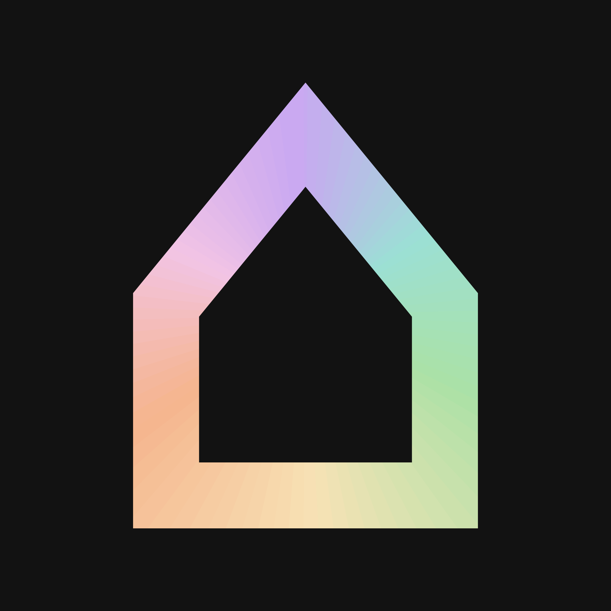
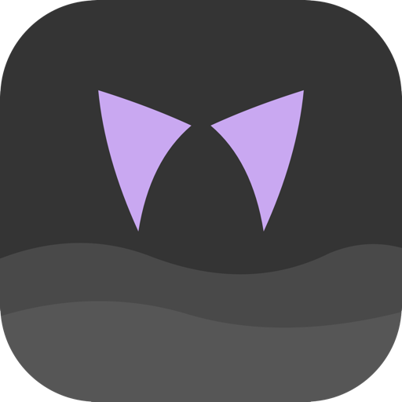

# Brand assets

Logos, banners and colours for hausfold and the things it makes, with the rules
for using them. `hausfold.co/brand` lands here.

A mark's SVG is its source of record and the PNGs beside it render from it:
this repository's `assets/` for the house and nebelung, each product's own for
the rest. This page is the index, so there is one place to look. The *Logo
system* design project is where a mark is drawn and redrawn; it is not where
the current one lives. Every measurement behind them (the ears, the tile, the
lockups, the type) is in
[`docs/design.md`](../docs/design.md), the visual standard, served at
[hausfold.co/design.md](https://hausfold.co/design.md).

  
  
  
  
  

Two registers. **The house** (hausfold the org, haus the layer, every desktop,
the site) is grey and borrows colour; its mark is the house. **The products**
each own one hue and wear the family's cat ears on a tile.

## Marks and banners

| | hue | files |
|---|---|---|
| **hausfold**, the org | none of its own; the ring of all six accents | [`hausfold-dark-square.svg`](./hausfold-dark-square.svg) and [`.png`](./hausfold-dark-square.png), 2048², on crust. [`hausfold-light-square.svg`](./hausfold-light-square.svg) and [`.png`](./hausfold-light-square.png), on the site's paper. The padded square for avatars and social profiles. The favicon, where the house fills the tile, is [`favicon.svg`](https://github.com/hausfold/hausfold.co/blob/main/public/favicon.svg) in the site's repository |
| **haus**, the layer, and every desktop | none | No mark, by decision. The wordmark alone; in a README the house glyph may stand in front of it: `⌂ haus` |
| **nebelung** | mauve | [`nebelung-square.svg`](./nebelung-square.svg) and [`.png`](./nebelung-square.png), 512². [`nebelung-square-inverted.svg`](./nebelung-square-inverted.svg) and [`.png`](./nebelung-square-inverted.png). Banner [`nebelung-banner.png`](https://github.com/hausfold/nebelung/blob/main/assets/nebelung-banner.png), 800×232, and its light version, [`nebelung-banner-latte.png`](https://github.com/hausfold/nebelung/blob/main/assets/nebelung-banner-latte.png), 1600×464 |
| **pounce** | peach | [`pounce-square.svg`](https://github.com/hausfold/pounce/blob/main/assets/pounce-square.svg) and [`.png`](https://github.com/hausfold/pounce/blob/main/assets/pounce-square.png), 2048². [`pounce-square-inverted.svg`](https://github.com/hausfold/pounce/blob/main/assets/pounce-square-inverted.svg) and [`.png`](https://github.com/hausfold/pounce/blob/main/assets/pounce-square-inverted.png). Banner [`pounce-banner-rounded.png`](https://github.com/hausfold/pounce/blob/main/assets/pounce-banner-rounded.png), 1200×348 |
| **perch** | green | [`perch-square.svg`](https://github.com/hausfold/perch/blob/main/assets/perch-square.svg) and [`.png`](https://github.com/hausfold/perch/blob/main/assets/perch-square.png), 592². [`perch-square-inverted.svg`](https://github.com/hausfold/perch/blob/main/assets/perch-square-inverted.svg) and [`.png`](https://github.com/hausfold/perch/blob/main/assets/perch-square-inverted.png). Banner [`perch-banner.png`](https://github.com/hausfold/perch/blob/main/assets/perch-banner.png), 1200×348. [`perch-icon-master.png`](https://github.com/hausfold/perch/blob/main/assets/perch-icon-master.png), 2048², is the app icon's source |
| **trill** | yellow | [`trill-icon-master.svg`](https://github.com/hausfold/trill/blob/main/assets/trill-icon-master.svg) and [`.png`](https://github.com/hausfold/trill/blob/main/assets/trill-icon-master.png), 2048², the mark on its tile and the app icon's source. Banner [`trill-banner.png`](https://github.com/hausfold/trill/blob/main/assets/trill-banner.png), 1200×348. No inverted tile yet |
| **scruff** | maroon | No mark yet. The wordmark alone |
| **snug** | none yet | No mark yet. The wordmark alone |

A standard tile is the product colour on a `surface0` ground; an inverted tile
is the ground in the product colour with the shapes in dark. Everything is
drawn for a dark ground except the two named light files; a light set beyond
those is not drawn yet.

The pounce, perch and trill files live in those products' repositories, so a
change to a mark lands next to the app it names and this page never carries a
stale copy. nebelung's tiles live here because the palette repository holds
only its banners.

## Colours

Every colour is a [nebelung](https://github.com/hausfold/nebelung) token: the
palette is the one brand asset the whole family shares. The full sets, dark and
light, are
[`palette/nebelung.hex.json`](https://github.com/hausfold/nebelung/blob/main/palette/nebelung.hex.json)
and
[`palette/nebelung-latte.hex.json`](https://github.com/hausfold/nebelung/blob/main/palette/nebelung-latte.hex.json).
The ones a logo or a banner spends:

| | token | hex |
|---|---|---|
| nebelung | `mauve` | `#c9a8f1` |
| pounce | `peach` | `#f5b58e` |
| perch | `green` | `#abe1a6` |
| trill | `yellow` | `#f7e2b5` |
| scruff | `maroon` | `#e6a3ad` |
| the hacker desktop's accent, never a mark | `pink` | `#f2c4e5` |
| the ground behind a banner or a social card | `crust` | `#121212` |
| the tile | `surface0` | `#343434` |
| the grey story shape inside a mark | `surface1` | `#494949` |
| the second grey, for a lighter shape | `surface2` | `#5c5c5c` |
| text, and the hausfold wordmark on an artifact | `text` | `#d7d7d7` |
| muted text | `subtext0` | `#aeaeae` |

The six accents, in the order the house's ring turns through them: mauve,
maroon, green, yellow, peach, pink. There is no seventh.

## Using them

The short version of the standard, for anyone putting a hausfold mark on
something. `design.md` has the long one.

- **The ears are never redrawn.** Move, scale or recolour them; never outline
  them, split them into two colours, cut them out of a shape or rotate them (pounce's 12° tilt is the one
  exception).
- **Flat.** No strokes, no gradients, no shadow, no blur, no gloss.
- **Wordmarks are lowercase**, in Space Grotesk on anything that is not a web
  page.
- **One hue per product, and none for the house.** hausfold, haus and the
  desktops stay grey. Do not colour the house, and do not give a desktop a
  mark.
- **No emoji as a stand-in.** Where a mark does not exist (haus, a desktop,
  scruff, snug), the name is set in text.
- **Radius 24 on the tile and the banner, 28 on the social card.** Copy the
  numbers in `design.md`; there is no grid behind them.

## Not here yet

Stated so nobody fills a gap by improvising; `design.md` keeps the full list
under *Not yet defined*.

- **Marks for scruff and snug**, a hue for snug, an inverted tile for trill,
  and light tiles for every product.
- **An SVG for `perch-icon-master.png`.** Every other mark here renders from
  its SVG; perch's app-icon source is the one still drawn only as a PNG.
- **Clearspace and minimum sizes.** The smallest proven ears are 62px, the
  smallest proven house 16px.
- **Screenshots.** None live here. [`SHOTLIST.md`](./SHOTLIST.md) is the
  policy (media sells, docs stay text), and the one current hero shot is
  [`haus/assets/hero.png`](https://github.com/hausfold/haus/blob/main/assets/hero.png).

[`drafts/`](./drafts) holds superseded candidates and [`site/`](./site) holds
unwired images for hausfold.co. Neither is part of the kit.
